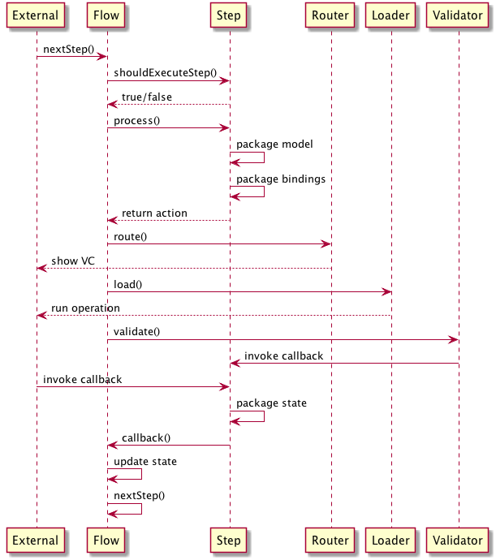

# Transfer Flow's proposed new architecture.

Send Money transfer is created via several steps that are currently orchestrated by `PaymentFlowKit`. It is written in Objective-C and is messy to say the least.
This project is a proof-of-concept of the new Transfer Flow (this is what it is called on other platforms) architecture.

This architecture is motivated by several points:
- Most of ViewControllers taking part of Transfer Flow are aduringlso used in other places, hence ViewControllers should have no knowledge of Transfer Flow.
- An engineer should have a simple way of understanding what are the Transfer Flow steps.
- Only Transfer Flow should know and care about its internal state.
- All components should be easily testable.

This proof of concept comprises of the following components:

### 1. FlowStep

`FlowStep` is a simple enum that contains _all_ the steps the flow has.

### 2. FlowState

`FlowState` is a struct that gathers the data necessery to complete the flow. Each `Step` fills a part of `FlowState`.

### 3. StepCalculator

`StepCalculator` decides based on the given `FlowState` what is the next `Step` that should be taken.

### 4. Step

`Step` is a protocol that describes a step of the flow. Implementors of this protocol are used to pack and unpack `FlowState` to a suitable format to the processor of the step - this is usually either a ViewController or a network operation.
Implementors are also used to supply bindings to ViewControllers and network operations that will call back to the step and then call back to the flows entry/reentry point.
Each `process` method of a `Step`'s implementation will return an `Action`. 

### 5. Action

`Action` is an instruction to `Flow` what to do next. Actions can be either `.sync` or `.async`. A `.sync` action has a `RoutingCommand` to be forwarded to `Router`. An `.async` action has, in addition to `RoutingCommand`, a `LoadingCommand` to be forwarded to `Loader`.

### 6. Flow

`Flow` is the central object and is a (kind of) reducer: it holds the `FlowState` and uses `StepCalculator` to get the next step to take. 
It processes the given `FlowStep` by firing `process` method on a suitable implementation of `Step`. `Flow` is also responsible for forwarding `Action` to `Router` and `Loader`.
`Flow` has the single entry and reentry point of the whole flow - `nextStep`. This method is given as a callback to every `Step`.

### 7. Router

`Router` is a protocol that is called out to when a ViewController needs presenting. It defines `RoutingCommand` enum that has a case for every ViewController that is participating in the flow.
If a participating ViewController needs some knowledge of current `FlowState` then this is packaged as a ViewController specific implementation of `RoutingModel`.
If a participating ViewController is interactive then a callback to `Flow` is packaged as `Bindings`.

### 8. Loader

`Loader` is a protocol that is called out to when a network operation needs to take place. It defines `LoadingCommand` enum that has a case for every network operation that is participating in the flow.
If an operation needs some knowledge of current `FlowState` then this is packaged as a operation specific implementation of `RoutingModel`.
Each operation will also receive a callback to call on completion.

## How it all fits together



```
@startuml
External -> Flow: nextStep()
Flow -> StepCalculator: calculateNextStep(from:)
StepCalculator -> StepCalculator: deduce next step from state
StepCalculator --> Flow: return next step
Flow -> Flow: processNextStep()
Flow -> Step: process()
Step -> Step: package model
Step -> Step: package bindings
Step --> Flow: return action
Flow -> Router: route()
Router --> External: show VC
Flow -> Loader: load()
Router --> External: run operation
External -> Step: invoke callback
Step -> Step: package state
Step -> Flow: callback()
Flow -> Flow: update state
Flow -> Flow: nextStep()
@enduml
```
